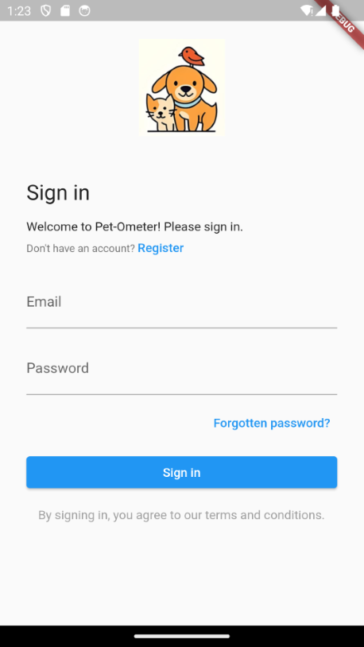
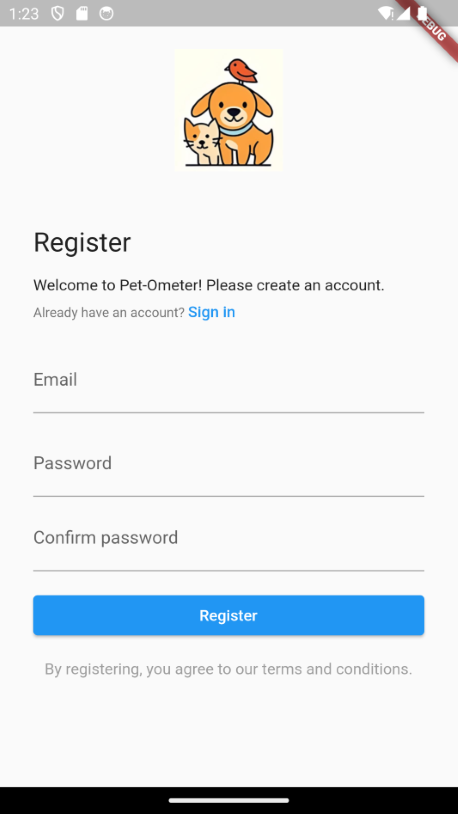
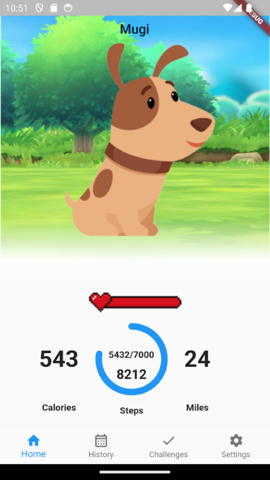
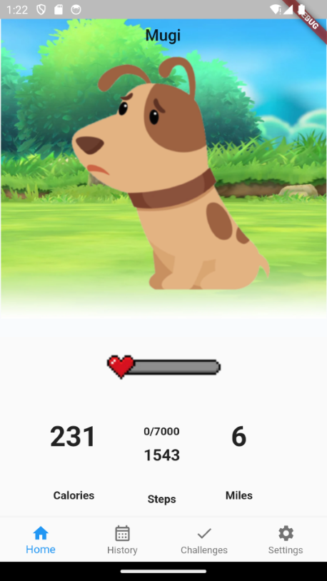
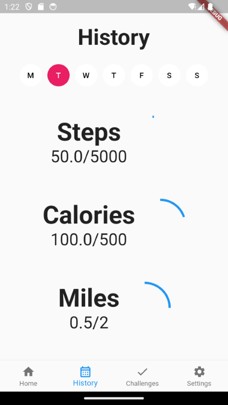
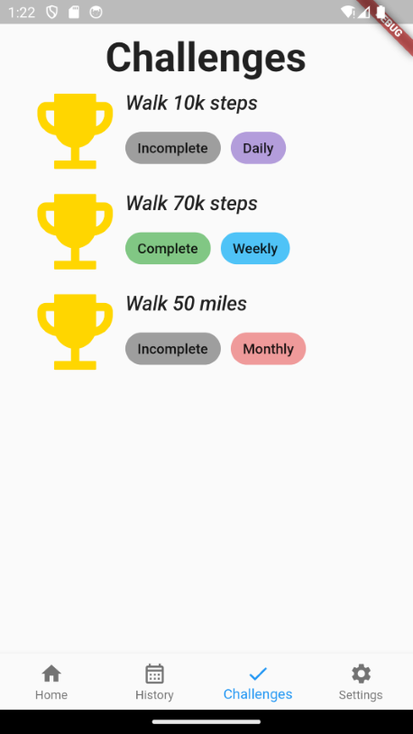
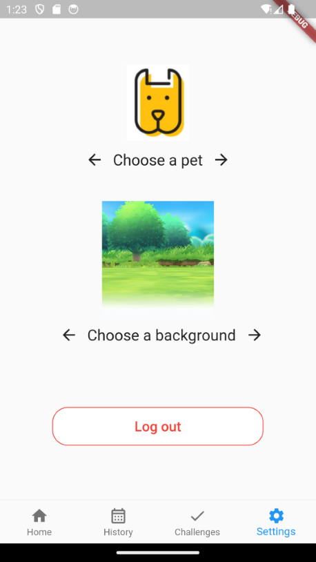

# Pet-Ometer

## Table of Contents
1. [Motivation](#motivation)
2. [Goals](#goals)
3. [Usage](#usage)
4. [Usability Evaluation](#usability-evaluation)
5. [Installation](#installation)
6. [Development Status](#development-status)
7. [Deployment](#deployment)
8. [About us](#about-us)

## Motivation

The motivation behind our mobile application is to inspire and promote regular exercise among individuals. In an increasingly sedentary world, we aim to leverage the convenience and accessibility of mobile technology to provide users with a unique and engaging experience by taking care of a virtual pets through regular exercise. Users can create and customize their virtual companions, which thrive on physical activity. By merging the worlds of fitness and virtual pet care, our app not only promotes physical well-being but also adds an element of fun and gamification to the journey towards a healthier life.

## Goals
In the development of our mobile app, our primary goal is to foster a culture of physical fitness by integrating the unique concept of caring for a virtual pet that relies on regular exercise for its well-being. We aspire to motivate users to embrace a more active lifestyle by making exercise a fun and rewarding daily habit through the nurturing and upkeep of their virtual companions. Beyond promoting physical health, our aim is to create a sense of responsibility and commitment among users, ultimately helping them achieve their fitness goals while enjoying the fulfilling experience of tending to their digital fitness partners.

## Usage
The Pet-Ometer utilizing the following tools/technologies:
- Github
- Android Studio
- Flutter
- Dart
- Firebase
- Firefoo

## Usability Evaluation
The following link is the testing and usability report for Pet-Ometer: [Usability Evaluation](https://github.com/Pet-Ometer/pet-ometer.github.io/blob/main/evaluation.md).

## App Screenshots
The following images are screenshots taken of the current state of the Pet-Ometer.

### Login Page

The login page is for users with existing accounts to access their virtual pet.

### Registration Page

The registration page is for non-registered users to create and customize their new virtual companion.

### Pedometer Page


The pedometer page shows a high level overview of the user's daily step count and other exercise metrics. This page also displays their virtual pet with their mood reflecting the user's daily exercise progress.

### History Page

The history page shows the user's weekly progress on their daily goals, which uses progress circles to represent how much of their goal was completed for each metric everyday.

### Challenges Page

The challenges page displays virtual challenges that the user may complete for a boost or sense of accomplishment, each challenge is paired with a complete/incomplete tag and a frequency of how often the user should do the challenge for (daily/weekly/monthly).

### Settings Page

The settings page is where the user can change the customization of their virtual companion or log out of their account.

## Installation
1. Navigate to the [Pet-Ometer repository](https://github.com/Pet-Ometer/App)
2. Clone it to your local machine by pressing the Code button
3. Open an IDE of your choice and run the command ```flutter run```

## Development status 
Here is a link to our completed [Phase 1 Project Board](https://github.com/orgs/Pet-Ometer/projects/1).
<br>
Here is a link to our completed [Phase 2 Project Board](https://github.com/orgs/Pet-Ometer/projects/2).
<br>
Here is a link to our completed [Phase 3 Project Board](https://github.com/orgs/Pet-Ometer/projects/3).
<br>
Here is a link to our completed [Phase 4 Project Board](https://github.com/orgs/Pet-Ometer/projects/4).
<br>
Here is a link to our completed [Phase 5 Project Board](https://github.com/orgs/Pet-Ometer/projects/6).

## Deployment
This version of the application is not deployed on any publicly available app store, it was tested using the Firebase App Distribution but not publicly shipped.

## About us

Cameron Arakaki - Software Engineering student at the University of Hawai`i at Manoa, portfolio linked [here](https://carakaki808.github.io/).

<br>


Eda Cadiena - Computer Science student at the University of Hawai`i at Manoa, portfolio linked [here](https://ecadiena.github.io/).
Contributions include: designing and implementing frontend user interface, organizing usability evaluations, updating proejct site weekly, and deployment for testing.
